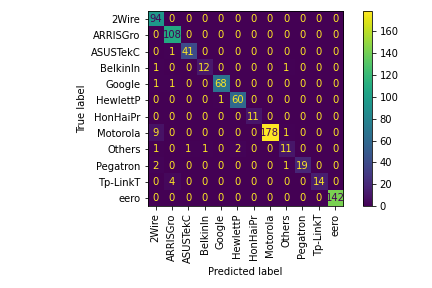
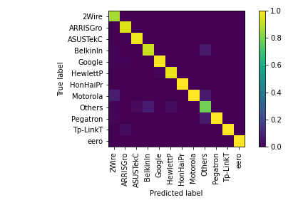
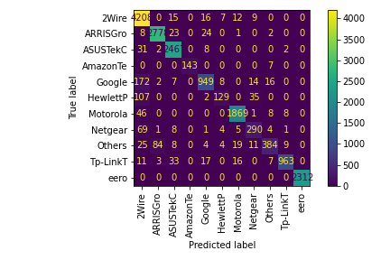
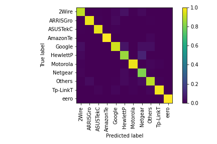
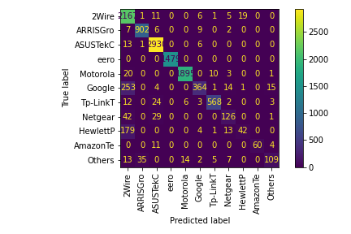
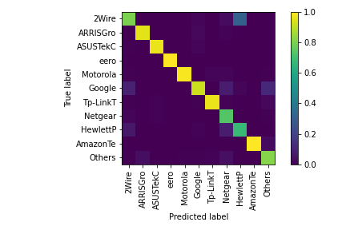

# Kaiyu's Notes

## Example: mulit-device classifier for Wi-Fi devices

sample-1: wlan_2020_11_05_03.pcap, 3910 packets

- juypter notebook: [devices-classifier-mulit.ipynb](example/devices-classifier-mulit.ipynb)

- confusion matrix



- normalized confusion matrix
  


- nPrintML, AutoML confusion matrix: [devices-classifier-mulit-nprintml.ipynb](example/devices-classifier-mulit-nprintml.ipynb)


sample-2: wlan_2021_03_04_04-2.4GTrain.pcap, 116114 packets

- juypter notebook: [devices-classifier-mulit-largePCAP.ipynb](example/devices-classifier-mulit-largePCAP.ipynb)

- confusion matrix



- normalized confusion matrix
  


- We directly apply classifier from training sample-2 to sample-3: wlan_2021_03_04_04-2.4Test.pcap, 20302 packets

- Looks great!






- Requirement packages
```shell
sudo apt install libpcap-dev
sudo apt install argp
sudo apt install automake autoconf
sudo apt install autotools-dev 
```

- Install
  - You may not need `sudo`. But it doesn't work without `sudo` on my machine.
  - `make install` may not be necessary if you just want the `nprint` executable.
```
autoreconf -i
sudo ./configure
sudo make
sudo make install
```

# After modification:
Repeat the following steps to make the change work
- Add filename to Makefile.am
- autoreconf -i
- sudo ./configure
- sudo make
- sudo make install

# Understand the Source Code of nPrint
When a pcap coming, it will be processed in the following pipeline:
- New PCAPParser(FileParser)
- set_filwriter = new FileWriter
- FileParser.set_conf
  - format_and_write_header
  - fw->write_header
  - build_bitstring_header
    - mannually set the answer: header vector
- process_file
  - pcap.pcap_loop
    - packet_handler
- [pcap_parser] packet_handler
  - [file_parser] process_packet: return sp
    - in sp: set_raw
  - pcp->write_output(sp)
    - sp->get_bitstring
      - ipv4_header.get_bitstring


# Related parsers for radiotap header and 802.11 header

- <netiinet/ip.h>: part of libpcap-dev

- http://lxr.free-electrons.com/source/include/linux/ieee80211.h, and then access the SSID.

- #include <arpa/inet.h>

- radiotap-library
#include "ieee80211_mgmt.h"
https://github.com/radiotap/radiotap-library

- ieee80211.h
https://github.com/the-tcpdump-group/libpcap/blob/master/ieee80211.h
https://github.com/the-tcpdump-group/tcpdump

- Parsing
https://stackoverflow.com/questions/32331886/how-to-use-802-11-headers-with-libpcap


- Ubuntu Man page
http://manpages.ubuntu.com/manpages/bionic/man9/ieee80211_radiotap.9freebsd.html

- Real one !!!
https://github.com/openbsd/src/tree/master/sys/net80211
Search: ubuntu install net80211


# Original Readme from nPrint: 

https://nprint.github.io/nprint/

# Details
Overview / Original nPrint paper can be found here: https://nprint.github.io/nprint/

Detailed usage and installation information can be found in the nPrint wiki: https://github.com/nprint/nprint/wiki

There is a very basic end-to-end tutorial on nPrint in a machine learning pipeline here: https://github.com/nprint/nprint/blob/master/example/nprint-ml-tutorial.ipynb

There will be bugs! Please report any you see.
